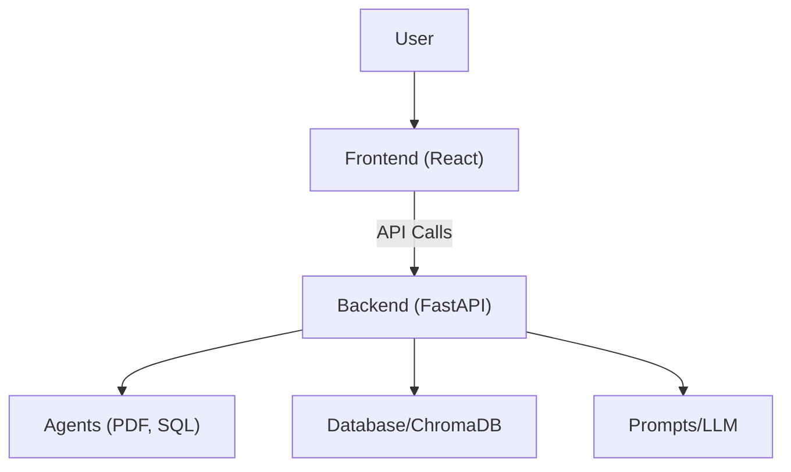
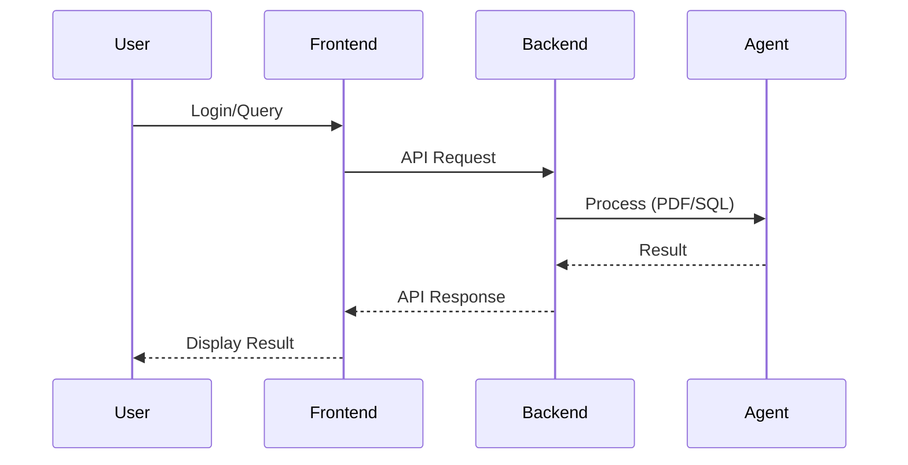

# FINGPT Architecture & Code Documentation

## 1. Project Overview

**FINGPT** is a full-stack application designed to provide financial insights, recommendations, and analysis using AI agents. It consists of a backend (Python, FastAPI) and a frontend (React, TypeScript, Vite, Tailwind).

---

## 2. High-Level Architecture

- **Frontend**: User interface for login, chat, and analysis.
- **Backend**: API server, agent orchestration, data storage.
- **Agents**: Specialized modules for PDF and SQL analysis.
- **Database**: Stores user data, financial data, and embeddings.
- **Prompts/LLM**: Handles prompt engineering for AI responses.

---

## 3. Low-Level Architecture

### Backend

- **FastAPI**: Main web server, handles routing and API endpoints.
- **Agents**: Python classes for handling PDF and SQL tasks.
- **Database**: Likely SQLite or similar, managed via `database.py`.
- **ChromaDB**: Vector database for embeddings and semantic search.
- **Prompts**: Custom prompt templates for LLM tasks.

### Frontend

- **React**: SPA with TypeScript.
- **Component-based**: Modular UI (Chat, Login, Signup, Animations).
- **API Layer**: Handles communication with backend.
- **State Management**: Likely React state/hooks.

---

## 4. Component/Module Breakdown

### Backend

- `main.py`: FastAPI app entry point, includes route registration.
- `routes/`: API endpoints (e.g., `auth.py`, `query.py`).
- `agents/`: Business logic for PDF and SQL analysis.
- `models/`: Database models and schemas.
- `prompts/`: Prompt templates for LLM.
- `database.py`: Database connection and ORM setup.

### Frontend

- `src/components/`: UI components (ChatWindow, LoginScreen, etc.).
- `src/pages/`: Page-level components (Index, NotFound).
- `src/config/api.ts`: API endpoint configuration.
- `src/hooks/`: Custom React hooks.
- `src/lib/utils.ts`: Utility functions.
- `public/`: Static assets.

---

## 5. Data Flow

1. **User logs in** via the frontend.
2. **Frontend** sends credentials to backend (`/auth` route).
3. **Backend** authenticates and returns a token/session.
4. **User interacts** (e.g., uploads PDF, asks a question).
5. **Frontend** sends request to backend (`/query` route).
6. **Backend** processes request:
    - If PDF: Uses PDF agent.
    - If SQL: Uses SQL agent.
    - May use ChromaDB for semantic search.
    - Uses prompt templates for LLM.
7. **Backend** returns response to frontend.
8. **Frontend** displays results.

---

## 6. How the Code Works

### Backend

- **Startup**: `main.py` initializes FastAPI, loads routes.
- **Authentication**: `routes/auth.py` handles login/signup.
- **Query Handling**: `routes/query.py` receives user queries, dispatches to agents.
- **Agents**: 
    - `pdf_agent.py`: Extracts and analyzes data from PDFs.
    - `sql_agent.py`: Executes and analyzes SQL queries.
- **Database**: `database.py` manages connections and ORM models.
- **Prompts**: `prompts/` contains templates for generating LLM prompts.

### Frontend

- **App Entry**: `main.tsx` bootstraps the React app.
- **Routing**: Page navigation handled in `src/pages/`.
- **UI Components**: Modular, reusable components for chat, login, etc.
- **API Calls**: `config/api.ts` defines endpoints; components use hooks to fetch/send data.
- **State**: Managed via React hooks and context where needed.
- **Styling**: Tailwind CSS for utility-first styling.

---

## 7. Extending the Project

- **Add new agents**: Create a new agent in `agents/`, add route in `routes/`, update frontend to support new functionality.
- **Add new UI features**: Create new components in `src/components/`, update pages as needed.
- **Integrate new databases**: Update `database.py` and models.

---

## 8. Deployment & Running

### Backend

1. Install dependencies:  
   `pip install -r requirements.txt`
2. Run server:  
   `uvicorn main:app --reload`

### Frontend

1. Install dependencies:  
   `npm install`
2. Run dev server:  
   `npm run dev`

---

## 9. Example Sequence Diagram

---

## 10. File/Directory Purpose Table

| Path                        | Purpose                                      |
|-----------------------------|----------------------------------------------|
| financegpt-backend/main.py  | FastAPI app entry point                      |
| financegpt-backend/routes/  | API endpoint definitions                     |
| financegpt-backend/agents/  | Business logic for PDF/SQL analysis          |
| financegpt-backend/models/  | Database models                              |
| financegpt-backend/prompts/ | LLM prompt templates                         |
| financegpt-backend/database.py | DB connection/ORM setup                  |
| financegpt-frontend/src/    | React app source code                        |
| financegpt-frontend/public/ | Static assets                                |
| financegpt-frontend/components.json | UI component registry (if used)     |

---

If you need a deep dive into any specific part (like a detailed agent or UI component breakdown), please ask! 